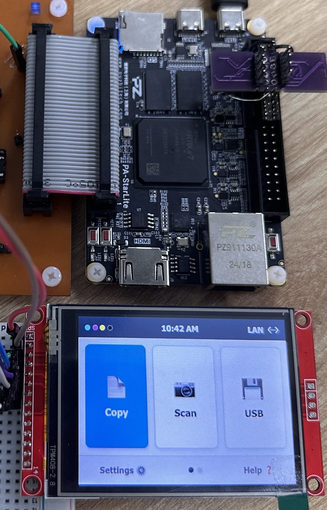

## How it works

**SotaSoC** is a compact RISC-V System-on-Chip (SoC) targeting [**Tiny Tapeout**](https://tinytapeout.com) tape-out and also capable of running on **Artix 7 FPGA** with Vivado. Suitable for custom boards, teaching, and as a base for your own SoC. Software support includes **FreeRTOS**, **MicroPython** (in development), and **bare-metal**.

### Supported ISA Extensions

- **E** — RV32E: 32-bit RISC-V with 16 general-purpose registers (embedded profile).
- **C** — RISC-V Compressed instructions.
- **Zicsr** — Control and Status Register extension.
- **Zifencei** — Instruction-fetch fence extension.

### Peripherals

- **QSPI Flash** and **QSPI PSRAM** — 128 Mbit Flash for code and data, 64 Mbit PSRAM for runtime memory
- **UART** — programmable baud rate via 10-bit clock divider; default 115200 at 64 MHz
- **48-bit timer** (mtime)
- **13× GPIO** — 1 bidirectional (in/out), 6 input (with interrupt), 6 output
- **2× PWM** — 2 independent channels; 16-bit period and duty (in clock cycles), configurable frequency and duty cycle per channel
- **SPI** — master; full mode support (CPOL/CPHA), clock up to 16 MHz, configurable; 4-byte buffer
- **I2C** — master; clock configurable via 8-bit prescaler — 100 kHz, 400 kHz, 1 MHz, and others; START, STOP, repeated START, byte read/write with ACK/NACK

### Board Support Package (BSP)

A BSP is available for **FreeRTOS** and **bare-metal** development:

- [FreeRTOS BSP](https://github.com/sotatek-dev/SotaSoC-BSP/tree/main/examples-freertos)
- [Bare-Metal BSP](https://github.com/sotatek-dev/SotaSoC-BSP/tree/main/examples-baremetal)

### Demo

SotaSoC is capable of driving real-world applications such as a **320×240 ST7789 LCD** display at ~10 FPS via SPI at 16 MHz clock.

*The photo above was taken from a test on an Artix 7 FPGA; the tapeout chip is not yet available.*

More examples and demos are available in the [SotaSoC-BSP](https://github.com/sotatek-dev/SotaSoC-BSP) repository.

For more detailed technical information, see [https://github.com/sotatek-dev/SotaSoC](https://github.com/sotatek-dev/SotaSoC).

## How to test

### 1. Write firmware to Flash

Download the blink firmware: [blink.bin](https://github.com/sotatek-dev/rv32e-bsp/blob/main/examples-baremetal/blink/build/blink.bin), then write it to Flash at address **0x0000_0000**.

You can also use any other example from the [SotaSoC-BSP](https://github.com/sotatek-dev/SotaSoC-BSP) repository.

### 2. Connect an LED to uio[7]

SotaSoC only supports **RAM A** on the [QSPI Pmod](https://github.com/mole99/qspi-pmod). Cut the trace for **RAM B** and use **uio[7]** as a GPIO pin.

Connect one LED (with a suitable series resistor) to pin **uio[7]**.

### 3. Reset and run

Reset the board. The LED should blink.

---

## External hardware

To test **blink**: you need a **[QSPI Pmod](https://github.com/mole99/qspi-pmod)** (cut the trace for **RAM B** / **PMOD8** so that uio[7] can be used as GPIO) and **one LED** connected to pin **uio[7]** as described in How to test above.

To test **other peripherals** (UART, PWM, SPI, I2C, etc.), refer to the specific examples in the [SotaSoC-BSP](https://github.com/sotatek-dev/SotaSoC-BSP) repository.
